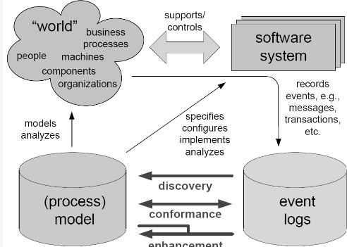
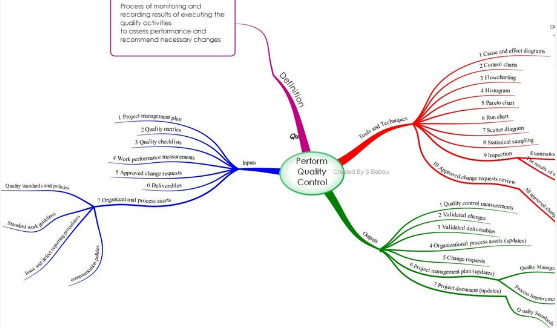
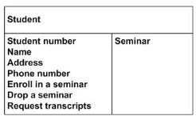

# H02: eliciteren

## Processen ontdekken

- opzetten van het project: samenstellen team
- informatie verzamelen: bekomen van goed begrip vh proces
- begeleiden van de modelleertaak: procesmodel
- kwaliteitsborging: modellen beantwoorden aan kwaliteitscriteria

Uitdagingen

- gefragmenteerde proceskennis
- domein-experten denken op 'instance'-niveau
  - proces-instance: unieke passage doorheen een proces → voor 1 bepaalde klant/leverancier/...
- kennis over procesmodellering is zeldzaam

Voorbeeld van een proces: lassen van een reeks identieke stukken op een lasrobot

## Expertise van procesanalisten

- problemen begrijpen
  - kennis vh probleemdomein
  - kennis vd organisatie helpt om probleem te structureren
- problemen oplossen
  - identificatie procestriggers
  - hypothese-beheer: formuleren en testen vanhypotheses
  - uitzetten van doelstellingen: wat is de volgende stap
  - top-down strategie gebaseerd op de doelstellingen
- modelleerskills
  - structuur, duidelijke layout, systematische labels
  - expliciete start- en eindpunten
  - gepaste granulariteit & decompositie

## Elicitatietechnieken

- creatieve technieken
  - brainstorm
  - invalshoek veranderen
  - gebruik maken van een analogie
- uitvraagtechnieken
  - interviewen
  - enquête houden
- observatietechnieken
  - veldobservatie
  - werkstage

 
<!--\pagebreak--> 

- documentatie-georiënteerde technieken
  - systeemarcheologie
  - lezen vanuit specifiek oogpunt
  - hergebruik van requirements
- ondersteunende technieken
  - mind mapping
  - workshops
  - CRC-kaarten
  - audio & video opnamen
  - use cases
  - prototypen

### <u>Creatieve technieken</u>

<u>Brainstorm</u>

- nadelen
  - ervaren moderator nodig
  - sommige deelnemers veel dominanter dan anderen
- alternatieven: brainwriting via 6-3-5 methode of GPS

<u>invalshoek veranderen</u>: 6 denkhoeden

- blauw: overzicht, controle, afstandelijkheid, voorzitter, dirigent
- zwart: kritiek, analyse, negatief, zwartkijken, oordelen
- rood: emoties, gevoelens, ingevingen, intuïtie, spontaan
- wit: feiten, cijfers, informatie, objectiviteit, neutraal
- groen: creativiteit, alternatieven, provocatie, energie, verandering
- geel: positief, constructief, voordelen, kansen, optimisme

<u>gebruik maken van een analogie</u>

- analogieën stimuleren creativiteit
- vb: ziekenhuislogistiek rond behandelen van patiënten vergelijken met werkprocessen op Zaventem

### <u>Uitvraagtechnieken</u>

<u>interviewen</u>

- meest gebruikte techniek
  - huidige uitdagingen, ideale toekomstbeeld, ...
  - verstaan & ontdekken van details
- doel ve interview kan verschillen
- succesvol interviewen
  - voorbereiding & ervaring
  - verstandhouding opbouwen
  - de juiste persoon interviewen
  - bereidheid interviewee

 
<!--\pagebreak--> 

- sterkten
  - focus op dialoog
  - uiten van gevoel & opinie in privé sfeer
  - opbouwen ve relatie
  - discussie zonder de nadelen ve meeting
- nadeel
  - veel tijd in beslag door feedbacksessies: interview → documentatie/modellen → verificatie → validatie → interview → ...
- challenges
  - resultaat kan verkeerd worden geïnterpreteerd
  - soms wordt info achtergehouden
- waarom interviewen?
  - achterliggende reden voor een feature/upgrade/...?
  - is er een bug die gefixed moet worden?
  - wie wordt er geïmpacteerd?
- wie interviewen?
  - sponsor: leadership perspectief → inzicht in visie & uiteindelijke doel
  - manager & verantwoordelijken: impact op hun omgeving
  - eindgebruikers: direct inzicht in problemen/opportuniteiten, huidige frustraties
- hoe interviewen
  1. voorbereiding
     - doel, rollen, vragen, fysiek/online
     - interview plan: datum, plaats, project, interviewee, rol/reden vd interviewee, hoofdvragen
     - vragen: 3 tot 5 hoofdvragen, open vragen en gesloten vragen (enkel voor verduidelijking) → 3-5 open in combi met gesloten
  2. uitvoeren interview
     - band opbouwen, verwachtingen stellen
     - goeie vragen stellen
       - zoek wat nodig is, niet gewenst: stated vs actual requirements
     - actief luisteren
       - be attentive
       - ask open-ended questions
       - ask probing questions
       - request clarification
       - paraphrase
       - be attuned to and reflect feelings
       - summarize
     - notuleren
     - afsluiten vh interview
  3. interview - follow-up
     - formele bedanking: bedanken voor tijd
     - nota's review: bedoelingen juist gecapteerd?
     - acties opstellen

 
<!--\pagebreak--> 

<u>enquête houden</u>

- fysiek of digitaal
- open of gesloten, of combinatie
- voordelen
  - veel info in korte tijd
  - snelle verwerking
  - geen remmingen indien anoniem
- nadelen
  - deelnemers kunnen vragen verkeerd interpreteren
  - je mist de non-verbale communicatie

### <u>Observatietechnieken</u>

<u>veldobservatie</u>

- gebruiker werkt in bijzijn van analist
- varianten: geen interactie of gebruiker legt uit wat hij doet

<u>werkstage</u>

- analist voert zelf het werk uit
- tijdrovend, levert diepgaande kennis op

### <u>Documentatie-georiënteerde technieken</u>

<u>systeemarcheologie</u>  

<u>lezen vanuit specifiek oogpunt</u>

- documenten verwijzen naar rollen, activiteiten business-objecten
- formele documentatie
  - organigram van de organisatie
  - tewerkstellingsplannen
  - kwaliteitsrapporten(bv. bijcertificaties), auditrapporten
  - interne policy: missie-, visie-, stratiegiedocumenten
  - interne en externe reglementen
  - woordenlijsten en handboeken
  - workinstructies
  - invulformulieren

<u>hergebruik van requirements</u>

- eerder uitgevoerde analyses
- tijd & kosten voor analyse sterk reduceren

### <u>Ondersteunende technieken</u>

<u>mind mapping</u>  

<u>workshops</u>

- key-stakeholders samenbrengen
- discussiëren om gedeeld begrip te creëren
- software-ondersteund
  - afzonderlijke rol naast moderator
  - tijdens workshop modellen tekenen
- model dient als referentie voor verdere discussies
- alternatief (voor SW): brown-paper workshops (met post-its en tijdlijn)

<u>CRC-kaarten</u>

- Class Responsibility Collaboration
- relevante business-objecten op kaarten schrijven
- workshopdeelnemers voegen daar eigenschappen aan toe
- kaarten gebruikt om processen & requirements in kaart te brengen  

<u>audio & video opnamen</u>

- gebruikt bij veldobservatie, interviews & workshops
- nadeel: deelnemers gaan zich misschien anders gedragen

<u>use cases</u>

- elementaire bedrijfsprocessen: 1 persoon, 1 tijdsspanne, 1 plaats
- deel van een groter geheel
- helpen om elicitatieproces te structureren

<u>prototypen</u>  
= werkende software van kritieke delen ve toekomstig systeem

## Techniekkeuze
- combinatie van technieken nodig
- houd bij keuze rekening met
  - menselijke aspecten
    - communicatieve & persoonlijke vaardigheden van stakeholders
    - ervaring met bepaalde technieken
    - mate waarin stakeholders zich bewust zijn van requirements
  - organisatorische aspecten
    - beschikbaarheid belanghebbenden: veldobservatie goed voor weinig tijd
    - beschikbare budget & doorlooptijd
    - workshop is tijdbesparen, letten op geografische spreiding
    - creatieve technieken minder gangbaar bij fixed-price-date
  - vakinhoudelijke aspecten 
    - vereiste detailniveau beïnvloedt keuze
    - ervaring analist met bepaalde technieken

### <u>Verschil in keuze van technieken</u>
- startup met 100 werknemers vereist andere aanpak dan overheidsbedrijf

### <u>Invloed van de bedrijfscultuur</u>
Open cultuur
- alle medewerkers aangemoedigd om ideeën te delen
- gebruik workshops om ideeën te delen

Strikt-hiërarchische organisaties
- zorg dat elke stakeholder gelijk aan bod komt
- anonieme enquëtes als aanvullende techniek

 
<!--\pagebreak--> 

# Addendum: interview tips
- gestructureerd vs ongestructureerd
- combinatie open en gesloten vragen
- veronderstelling: analist en stakeholder verstaan elkaars terminologie
- LSD: Luisteren, Samenvatten, Doorvragen

## Luistervaardigheden
- empathie: spreker op een ondersteunende & behulpzame manier uithoren
- analyse: concrete info zoeken en feiten & gevoelens uit elkaar houden
- synthese: stuur gesprek pro-actief in richting ve voorad vastgestelde doelstelling

## Enkele tips
- planning
- goede voorbereiding: info zoeken over persoon/bedrijf, vragen voorbereiden
- tijdens gesprek
  - verwelkoming, neem plaats
  - begin met neutrale vragen
    - veel-prater: gesloten/half open vragen
    - niet-prater: open vragen
  - bedanking aan einde gesprek
- non-verbale communicatie: let op houding