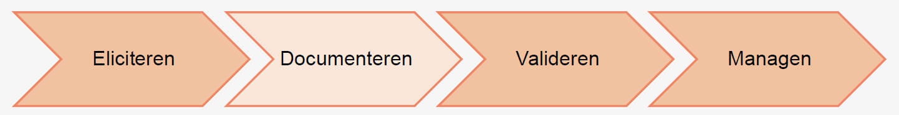
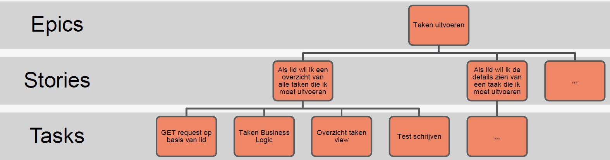
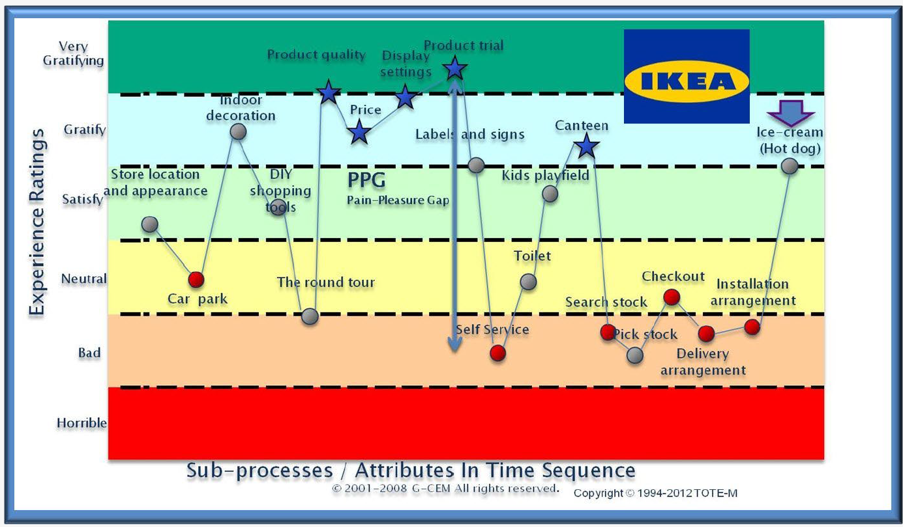
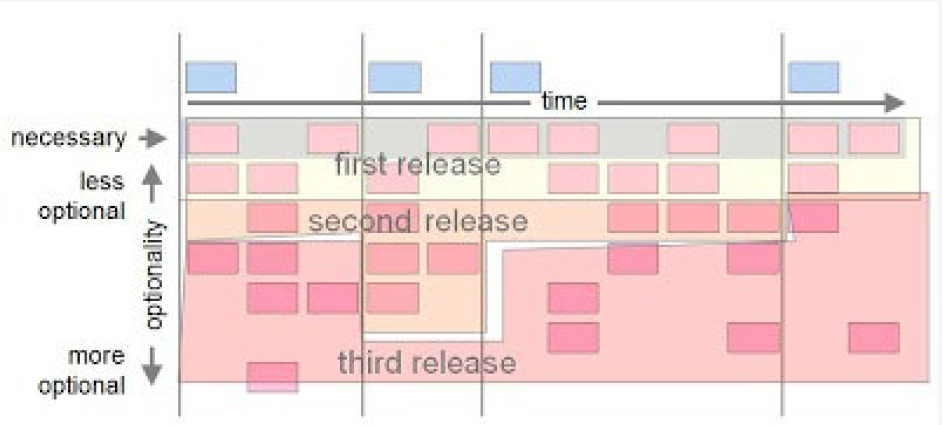

# H03: documenteren

## Situering

## Functionele requirements beschrijven
- Use cases: analyse techniek & specificatie
- User stories: communicatiemiddel voor requirements & moet aangevuld worden met extra technieken

## User stories
Vorm
- Als een {wie}
- Wil ik {wat}
- Zodat {waarom}

Wat
- korte beschrijving van wat een gebruiker wil
- beschrijft in gewone spreektaal van de gebruiker wat de gebruiker (moet) doen
- gebruikt binnen agile software development
- weinig details, moet passen op een post-it

Waarom
- makkelijk te verstaan: geen voorkennis vereist of technisch jargon
- makkelijk te delen: doel is communicatie tussen IT & business
- lage inspanning: snel opstellen, kan just-in-time
- moeten niet perfect zijn: discussie zal voor duiding zorgen
- makkelijk te plannen: stelt een werkitem voor

Eigenschappen
- Niet gebonden aan IEEE-guidelines
- Zijn geen use cases: scope, volledigheid, levensduur, doel

Richtlijnen → INVEST
- Onafhankelijk → Indipendent
- Onderhandelbaar → Negotiable
- Waardevol voor gebruiker & opdrachtgever → Valuable
- Schatbaar → Estimatable
- Klein → Small
- Testbaar → Testable  

### <u>Negotiable - onderhandelbaar</u>
- Beschrijven requirements zonder te specifiëren
- Start ve conversatie
  - Product owners: bepalen richting (wat)
  - Developers: hoe er te geraken (hoe)
- User stories kunnen wijzigen doorheen de tijd
  - Meer kennis
  - Stories splitten of worden onnodig
- Zo laat mogelijk details toevoegen

### <u>Valuable - waardevol</u>
- Moeten business waarde bevatten
  - Meer opbrengsten, lagere kosten, klanten aantrekken, personeel efficiënter maken, …
- Gesloten stories: eindigt met een user's goal
- Slice the cake: aandacht geven aan alle lagen van de applicatie
- Database tabellen aanmaken, business logica schrijven, UI… zijn onderdelen van een user story, geen user story op zich
- Voorbeeld
  - Als een klant wil ik producten kunnen filteren op prijs zodat ik snel de producten kan vinden binnen mijn prijsklasse

## Stories, epics & tasks

- Meerdere niveau's van detail: business ↔ technisch

### <u>Epics</u>
- Groot stuk functionaliteit die business wil hebben & waarde oplevert
- Opgeleverd ahdv kleinere user stories, meerdere iteraties
- Format van user stories moet niet gevolgd worden: moet groot zijn, wie/wat/waarom wel belangrijk

### <u>Tasks</u>
- Story kan onderverdeeld worden in uitvoerbare taken
- Geschreven door Dev team, voor Dev team
  - Mogen technische zaken bevatten
  - Hoeft geen directe business value te hebben
  - Moeten niet onafhankelijk zijn
  - Hoeveel niet vertical (end-to-end) te zijn

 
<!--\pagebreak--> 

- Input van DevOps is belangrijk
  - Nodig systemen/hardware
  - Beperkingen naar security toe
  - Aparte technical tasks voor DevOps

## Belang story writing
- Business: create value
- Users: get a job done
- Delivery: make it feasible  

→ Shared understanding  

## Customer journey
Voorbeeld customer journey: IKEA  

- Visualiseert ervaring vd klant aangaande doelen/fases/activiteiten/contactpunten/emoties
- Doel: inzicht krijgen in gedrag vd klant
  - Toont mogelijks problemen
  - Identificeert opportuniteiten
  - Aligneert de organisatie
- Stappenplan
  - Creëren van persona's
  - Identificeren van verschillende fases, met doel en beschrijving vd activiteit
  - Identificeer contactpunten tussen klant en bedrijf
  - Beschrijf gevoel vd klant tijdens de actie
  - Identificeer de belangrijkste acties
  - Vind ideeën voor verbeteringen

## Van customer journey naar story map
- Beslis wat onderzocht moet worden: bestaand/nieuw product/service, ...
- Bekijk customer journey maps, detecteer kansen/bedreigingen
- Beschrijf hypothese: ik denk.., het zou kunnen.., dat kan lijden tot...
- Identificeer de nodige capabilities

 
<!--\pagebreak--> 

## Story map

- Visuele oefening om shared understanding te creëren → business & IT
- Horizontaal: verhaal verteld
- Verticaal: activiteit verder uitgewerkt
- Als alle activiteiten aanwezig: prioriteiten toevoegen
- Start van een product backlog
- Voorbereiden - co-create - verify - prioritize
  - Prioriteren: belangrijk → niet alles kan even belangrijk zijn
    - Prioriteer story map: stel doel op Minimal Viable Product
    - Voeg perspectief van de klant toe: Minimal Lovable Product
    - Challenge the feasability
    - Leg implementatie-scenario's vast: maak een roadmap

Prioriteren: MoSCoW
- Mo: Must have → essentiële elementen
- S: should have → belangrijke elementen
- Co: could have → leuke extraatjes
- W: won't have → voegen geen waarde toe

## Product backlog
- Resultaat ve story mapping
- Kan nog wijzigen doorheen project
  - prioriteiten veranderen
  - Must haves worden should/could of omgekeerd
  - Na iedere iteratie: feedback van klant en herbekijken