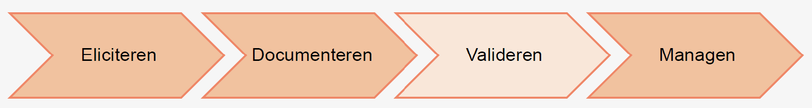
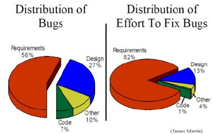
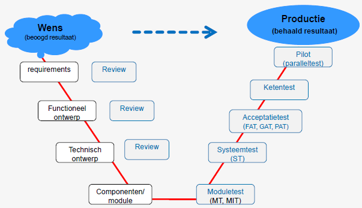
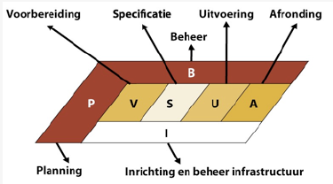
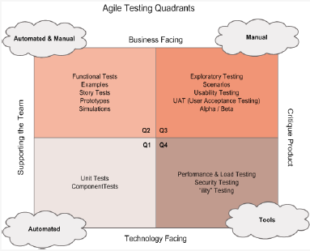
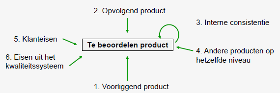

# H04: valideren

## Situering

## Acceptance criteria
- GWT
- 3 amigo's
- Testplan

## Valideren
- Begint met het bepalen van het succes
- 3 amigo's
  - Business: welke problemen willen we oplossen?
  - Development: hoe kunnen we het probleem oplossen?
  - Testing: lost deze oplossing het probleem kwalitatief op?
- Refinement sessies: user stories verduidelijken
  - Opsplitsen in kleinere stories
  - Acceptance criteria opstellen

## Acceptance criteria
- Bepalen succes vd user story
  - Gebruikt door de testers om te valideren
- Gangbare manier om te definiëren: Given - When - Then
  - Behavior Driven (BDD)
  - User story als basis, meer details erbij voor GWT
  - Geeft aanzet naar functionele testen

### <u>Give/When/Then</u>
Scenario: als een ingelogde user, wil ik kunnen inloggen op een website, zodat ik mijn persoonlijk profiel kan bekijken  

GWT
- Given: ik ben een uitgelogde user, ik ben op de sign-in pagina
- When: als ik username & password invul met correcte credentials en ik klik op sign-in knop
- Then: systeem logt mij in

## Testen
- Evolutie
  - Debuggen: onderdeel van programmeren
  - Zoeken naar fouten (los van programmeren)
  - Aantonen dat requirements voldaan zijn

Testen worden uitgebreider & gestructureerder
- Voldoen aan requirements
- Vinden van fouten
- Inzicht geven in kwaliteit
- Vertrouwen geven in kwaliteit van release
- Check op volledigheid & correctheid
- Advies geven over kwaliteit & risico's

Testen als vak
- Algemene kennis van informatietechnologie
- Kennis van infrastructuur, tools & ontwikkelomgeving
- Sociale vaardigheden
- Risk based testen
- Mensen, geld, tijd
- Verantwoorde wijze tests voorbereiden/uitvoeren
- Voldoende vertrouwen opbouwen om SW te accepteren

→ missing link tussen IT en business  

### <u>Waarom testen?</u>
- Voor organisatie houdt elke wijziging een risico in
- Beperken van risico's: flexibiliteit verhogen
  - Softwareontwikkelproces (Service Oriented Architecture)
  - Ontwikkelmethode die past bij de dynamiek van het bedrijf: agile development
  - Toepassen van controlemaatregelen: betrekken business bij opstellen/beoordelen systeemontwerp, uitvoeren van review/audits/...
  - Resultaatgedreven testen
    - Verificatie (het systeem goed bouwen)
    - Validatie (het goede systeem gebouwd is)
- Voorbeelden
  - Pentium-bug: FDIV bug (chip): niet genoeg precisie bij delen
  - Ariane 5: 2e vlucht: 2e trap niet losgekoppeld, oorzaak was SW-fout

### <u>Wanneer testen?</u>
- In elke ontwikkelingsfase
- Inspanning: 30% tot 70% van het totaal
- Aandacht voor testen: afhankelijk van mogelijke gevolgen/risico's

Foutdistributie  

Kost om defect te corrigeren
- Tijdens designfase: 1x
- Tijdens implementatie: 6.5x
- Tijdens testing: 15x
- Tijdens onderhoud: 100x

Schade aan klanten en gebruikers (dalende volgorde)
- Bedreigend voor veiligheid van menselijke wezens
- Aantasting ve essentiële organisatiefunctie
- Aantasting vd werking van firmware
- Aantasting ve essentiële organisatiefunctie, er is een vervanging beschikbaar door een alternatief systeem
- Aantasting vd goede werking ve software pakket voor business toepassingen
- Aantasting vd goede werking ve software pakket voor een private eindgebruiker
- Aantasting vd werking ve firmwaretoepassing maar zonder het volledige systeem te affecteren
- Brengt ongemakken voor de gebruiker mee maar verhindert hem niet om de systeemmogelijkheden te benutten

Schade aan de software-ontwikkelaar/organisatie
- Financieel verlies
  - Betaling schade voor fysieke blessures
  - Betaling schade aan organisaties voor de slechte werking van de softwareTerugbetaling van aankoopkosten aan klanten
  - Hoge onderhoudskosten voor het herstellen van falende systemen
- Niet-kwantitatieve schade
  - Negatieve impact op toekomstige verkoopcijfers
  - Substantiële terugval van de huidige verkoopcijfers

Toegevoegde waarde van testen
- Bijdrage aan het resultaat
- Oorzaak vd schade wegnemen
- Reductie van de impact
- Vertrouwen in het testobject
- Effectieve projectsturing

Binnen een SW-project
- Verschillende disciplines
- Verschillende belangen & aandachtspunten: projectmanager, programmeur, gebruiker, beheerder, business manager, tester

## 10 testprincipes
1. Focus op het resultaat
2. Bouw aan vertrouwen
3. Neem verantwoordelijkheid
4. Beheers het testvak
5. Sla bruggen
6. Test gefaseerd
7. Faciliteerde gehele IT-lifecyle
8. Geef overzicht en inzicht
9. Zorg voor herbruikbaarheid
10. Bedenk: testen is leuk!

### <u>1. Focus op het resultaat</u>
- Focus op business resultaat
- Meer dan alleen bijdrage aan SW-kwaliteit
- Testen die bijdragen aan resultaten die de organisatie nastreeft
- Verificatie: aantonen dat systeem gebouwd is volgens systeemontwerp
- Validatie: inzicht geven in de mate waarin het systeem past binnen de bedrijfsprocessen

### <u>2. Bouw aan vertrouwen</u>
- Vertrouwen opbouwen door intensief testen → minder kans op onopgemerkte fouten
- Probleem: beperkte resources (tijd, geld)
- Risicogebaseerd testen → belangrijke onderdelen grondiger testen
- Goede tester zoekt: fouten in andermans werk, goede elementen (positief kritisch)
- Goede tester betrekt actief belanghebbenden bij het bepalen van risicogebieden, aandachtspunten → transparantie/volledigheid/expertise
- Verlies geen tijd en energie met het maskeren van fouten
- Beter op tijd een probleem
- Ervaring: bereidheid/begrip/aanvaarding van de consequenties indien dit tijdig gesignaleerd wordt

### <u>3. Neem verantwoordelijkheid</u>
- Juiste testen voorbereiden
- Rekening houden met risico’s
- Testdekking
- Overzicht testproject incl. controle
- Sterk betrokken bij IT-lifecycle
  - Slechte inventarisatie van de klantwens
  - Ondoordacht ontwerp
  - Onvoldoende kwaliteit programmeerwerk
  - Slecht configuratie- en versiebeheer

### <u>4. Beheers het testvak</u>
- Testen is meer dan ‘knoppen drukken’
- Goede kennis van systeemontwikkeling, testmethodieken
- Goede kennis van processen in organisatie
- Gesprekspartner voor de gebruikers/managers
- Bruggen slaan

### <u>5. Sla bruggen</u>
- Veranderende requirements
- Inleving (belanghebbende)
  - De tester kan aan de ontwikkelaar uitleggen hoe de belanghebbenden naar het systeem kijken
  - De tester begrijpt de ontwikkelaar voldoende om samen met hem de bevindingen te analyseren

### <u>6. Test gefaseerd</u>
- Gefaseerd testen resulteert in de beste SW-kwaliteit
- Duidelijke project aanpak, planning
- Logische volgorde
- Afdekking van de belangrijkste risico’s
- Testproces
  - Strategie sluit aan op SW-ontwikkelproces
  - KSF worden verdeeld over verschillende testsoorten (planning)
- Voordelen
  - Elke partij kan zijn voorbereidend werk doen
  - Entry- en exitcriteria(!)
  - Stap-voor-stap wordt duidelijk of het systeem aan de verwachtingen voldoet

### <u>7. Faciliteer de gehele IT-lifecycle</u>
- Ontwerpfase
  - De producten toetsen op hun testbaarheid
  - Nagaan of het ontwerp aangeeft hoe het beoogde resultaat behaald gaat worden
- Ontwikkelfase
  - Hoe vroeger de fouten gededecteerd worden hoe beter
  - Moduletesten, module-integratietesten
- Beheerfase
  - Delen van de testware
  - Goede overgang van projectfase naar beheerfase

### <u>8. Geef overzicht en inzicht</u>
- Systeem = veel functies
- Per functie worden groot aantal testen uitgevoerd
- Testresultaten
  - Functietesten
  - Afdekken van risico’s, aandachtspunten, kwaliteitsaspecten

### <u>9. Zorg voor herbruikbaarheid</u>
- Tijdenshetgebruikvan de SW zullen nog fouten optreden
- Herbuikbare testset → automatiseren?
- Testtraject kost tijden geld → herbruikbaarheid = kostenbesparen
- Risicoanalyse actualiseren

### <u>10. Bedenk: testen is leuk!</u>
- Toegevoegde waarde binnen het SW-ontwikkelproces
- Verantwoordelijkheid voor het in productie gaan van een systeem
- Flexibel en creatief zijn
- Specialisatie is mogelijk: testautomatisering, performance-testen en security-testen

## Soorten testen
<u>Moduletest(MT) & module-integratietesten (MIT)</u>  

- Geautomatiseerd
- Whitebox-testen
- Unit-testen, component-testen, programma-testen

<u>Systeemtest (ST)</u>  

- Een heel systeem testen
- Blackbox-test
- Werkt het systeem conform het functionele ontwerp
- Bouwende partij

<u>Functionele acceptatietest (FAT)</u>  

- Een heel systeem testen
- Opdrachtgever
- Verificatie a.d.h.v. systeemeisen en functioneel ontwerp

<u>Gebruikersacceptatietesten(GAT)</u>  

- Validerende test
- Representatieve scenario’s uit het dagelijkse werk van de gebruikers
- Gebruiksvriendelijkheid, bruikbaarheid, ...

<u>Productieacceptatietesten (PAT)</u>  

<u>Ketentesten</u>  

- Samenwerking met de aanliggende systemen
- Integratietest

<u>Pilot</u>  

- Parallel testen met bestaande systeem

## Testen - vervolg
  

Verschillende testmethodologieën
- Agile testing
- Scripted testing
- Exploratory testing
- Rapid software testing

Afhankelijk van
- Project organisatie
- 'Application criticality'
- De testers

### <u>Testplan</u>
- Begin ve testtraject: testplan opstellen
- Doel vh testplan: aanpak vh testen binnen het programma/project/release/change te beschrijven
- Testplan opgesteld door de verantwoordelijke voor het testtraject → kan zijn de testmanager, de testcoördinator, de functioneel beheerder of ieder ander die de opdracht krijgt en aanvaard

Testplan
- Aanleiding → waarom
- Aanpak → hoe
- Benodigde mensen & middelen → wie en wat
- Benodigde planning → wat
- Op te leveren producten → wat

Onderwerpen die een rol spelen bij het opstellen van een testplan
- Teststrategie
- Randvoorwaarden en uitgangspunten
- Entry en exit criteria
- Testsoorten entestvormen
- Testontwerptechnieken

 

### <u>Wie voert de testen uit?</u>  
- Testers
- Programmeurs
- Business Analisten
- Ontwerpers (designers)
- Eindgebruikers
- Dedicated testing professionals
  - Opgeleid
  - Ervaren
  - 'Carriere'
  - Specialisatie
    - Security testers
    - Performance testing
    - Test automators
    - Embedded software testers  
- Testing is een erkend beroep

### <u>Testautomatisering</u>  

## Kwaliteitsborging
- Controle op basis van de opgeleverde tussenproducten of de vooropgestelde kwaliteit wordt bereikt
  - Vroegtijdig vaststellen van afwijkingen
  - Vroegtijdig herstellen
  - Kostenbesparend (Boehm)
- Hoe?
  - Collegiale reviews
  - Expert reviews
  - Inspecties
  - Walk-throughs
  - Monitoring (opdrachtgever) = audit

### <u>6 beoordelingsgrondslagen om een product te beoordelen</u>  

### <u>Toetstechnieken</u>
- Collegiale review
- Expert view
- Structured walk through
- Inspectie

<u>Collegiale review</u>  
- 