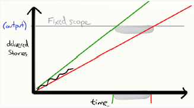
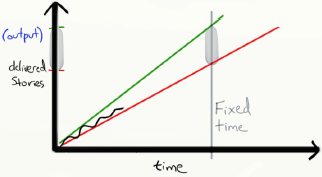
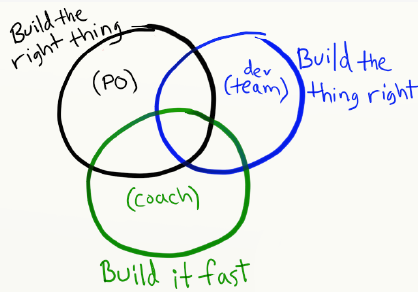

# H05: managen

## Situering
  

## Product owner
- Heeft een visie voor het project
- Aanspreekpunt voor de stakeholders
- Beheert de Product Backlog
- Aanspreekpunt voor dev team

## Recap - product backlog
- Resultaat ve story mapping: geprioriteerde product backlog
- Kan nog wijzigen
  - Prioriteiten
  - Must haves → could/should haves
  - Na iedere iteratie/feedback: weten wat er gewenst is

### <u>Product backlog beheren</u>  
Stakeholders hebben veranderende eisen
- PO beslist of het in Product Backlog past
  - Value vs effort
  - Must have vs Could have
- Communicatie is key: met stakeholders, dev team, eindgebruikers

## Hoe bepalen we value en effort

### <u>Estimating</u>
- Value: MoSCoW
- Effort: man-uren, t-shirt sizing, story points

### <u>T-shirt sizing</u>
- Relatieve manier om werk in te schatten
- Zeer ruw → eerst baseline

|Size|Tijd|||Size|Tijd|
|:--|:--|:--|:--|:--|:--|
|S|0-2 weken|||L|4-8 weken|
|M|2-4 weken|||XL|8-16 weken|

### <u>Story points</u>
Moeten rekening houden met
- Hoeveelheid werk
- Complexiteit
- Risico
- Afhankelijkheid

Fibonacci wordt vaak gebruikt
- 1, 2, 3, 5, 8, 13 (20, 40, 100)  

### <u>Refinement sessies</u>
Scrumt stel voor regelmatig refinement sessies te houden
- PO bespreekt & schat stories in met dev team
- Hoogste prio's op Product backlog
- Zoveel mogelijk JIT werken
- Leren uit de feedback loop geeft betere inschattingen

Dev team kan effort inschatten aan de hand van Story Points (planning poker)
- PO legt story uit
- Team geeft individuele estimates
- Team overlegt en bespreekt de estimates
- Team komt tot een consensus over het aantal story points van de story

## Sprint planning
- Product backlog in goede staat: prioriteiten en top stories
- Hoe bepalen wat volgende sprint haalt: velocity & yesterday's weather

### <u>Velocity</u>
- Snelheid vh team: hoeveel werk kan er gerealiseerd worden binnen tijdslimiet
  - Bv. aantal story points binnen een sprint
- Tijdens sprint review sessie kan velocity berekend worden
  - Hoeveel story point zijn er opgeleverd in de afgelopen sprint?
  - Wat betekend opgeleverd? (Definition of Done)
    - Development klaar? Getest? Deployed? User Accepted?
- Anders voor beginnen team/project → fluctueert

### <u>Yesterday's weather</u>
- Kijken naar verleden om voorspelling te doen
  - Hoeveel Story Points zijn er vorige sprint opgeleverd?
  - Geeft een indicatie hoeveel werk er in de volgende sprint kan opgenomen worden
- Vaak wordt een gemiddelde genomen van x laatste sprints
  - Voorkomt uitschieters door onvoorziene omstandigheden (ziekte, verlof, ...)

### <u>Forecasting</u>
- Door velocity bij te houden → forecasting met 'Burn-up chart'

|Wanneer zal 'x' klaar zijn?||
|:--|:--|
|**Wat zal er klaar zijn op moment 'y'?**||

## Build the right thing
- Rol van PO → focus op juiste oplossing

Maar niet enkel focus op perfecte oplossing  

## Scrum master
Essentiële rol!  
- Scrum process management
- Effectieve communicatie
- Team building & bescherming
- Progress tracking
- Quality check

 
<!--\pagebreak--> 

## Definition of done
Belangrijk onderdeel ve goed werkend agile team: goed gedefinieerde DoD  
- Scrum master kan dit faciliteren en afdwingen
- Opgesteld door Dev team, voor Dev team
- Bv. Getest, gedocumenteerd, deployed naar klant, PO approved, budget in orde

## Agile principes
- Scrum master op zoek binnen andere agile methodologieën om een team te verbeteren
- Uit eXtremeProgramming (XP) wordt vaak volgende principes gehaald
  - (Automated) testing
  - Refactoring
  - Pair programming
  - Permanente integratie

## Extreme programming

<u>Automated testing</u>

- Programma zonder geautomatiseerde test bestaat niet
- Allemaal op voorhand schrijven: onmogelijk → tijdsverlies

Hoe?
- Eenvoudig ontwerp
- Pair programming
- Vertrouwen
- Goed gevoel bij de gebruiker

<u>Refactoring</u>

- Permanent ontwerp en code wijzigen
- Tijdverlies, te weinig controle → crash

Hoe?
- "collective ownership"
- Eenvoudig ontwerp
- Standaard
- Pair programming/team
- Testen
- Permanente integratie

<u>Pair programming</u>

- Driver-navigator, piloot-copiloot  
- Ervaring, one team
- Met 2 weet je meer dan alleen

Hoe?
- Gebruik standaarden
- Minder stress
- Samen testen schrijven
- Samen eenvoudig ontwerp uitwerken
- Samen implementeren

<u>Permanente integratie</u>

- Code wordt geïntegreerd en getest na enkele uren

Hoe?
- Zeer snel testen
- Voortdurende refactoring
- Je werkt met 2

Continuous integration: evt. Jenkins  