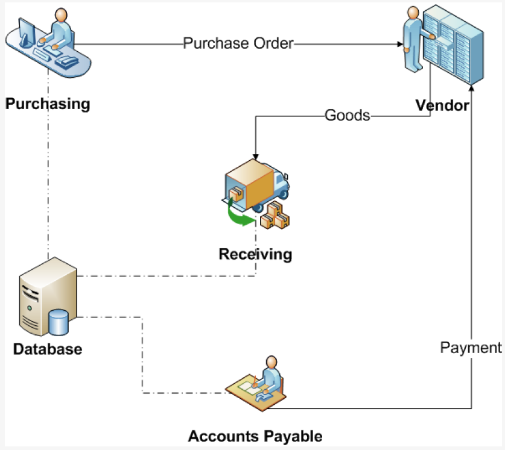

# H06: processen

## Situering

Ieder systeem ontwikkeld om bepaalde reden

- Beter procesbeheer
- Lagere kosten
- Beter benutten van commerciële mogelijkheden
- Verhogen vd servicegraad

→ Vooraf eisen helder en 1duidig formuleren = business case

## Business process management vs Business analyse

BPM

- Gericht op bedrijfsorganisatie
- Meestal voortraject van IT-project

Business analyse

- Vertrekt van resultaat BPM-oefening
- Gericht op IT-project
- Tijdens business analyse blijkt vaak nood aan procesoptimalisatie

## 1. Definitie van een proces

Definitie ISO 9000:2005: "een geheel van samenhangende/elkaar beïnvloedende activiteiten die input omzetten in output"

Definitie

- Transformatie van input naar output
- Creëren van waarde voor afnemer of klant (=belanghebbenden)
- Realiseren van doelen: bepaald door verwachtingen vd afnemers of belanghebbenden

Opmerkingen

- Input in proces: output van ander proces
- Processen in het algemeen gepland/uitgevoerd onder beheerste omstandigheden

Voorbeeld ve proces: afhandeling van IT-incident (doorheen de hele keten)

## 2. BPM (waarom - hoe)

Waarom  

Hoe

- Continuous Process Improvement (CPI)
  - Stelt huidige processtructuur niet in vraag
  - Identificeert problemen en lost ze 1 voor 1 op
- Business Process Re-engineering (BPR)
  - Stelt fundamentele veronderstellingen/principes vd huidige processtructuur in vraag
  - Gericht op het realiseren van een doorbraak

### <u>Case study Ford (Hammer 1990)</u>

Ford moest zijn aankoopproces hierzien om

- Het goedkoper te doen → kostenreductie
- Het sneller te doen → kortere doorlooptijden
- Het beter te doen → minder fouten

Situatie as-is

- In afdeling 'Leveranciersfacturen" > 500mensen
- Doorlooptijden voor verwerken van uitgaande bestellingen: grootte-orde van werken
- Automaisatie: verbetering van 20%

| Situatie | Voorstellingen                                   |
| :------- | :----------------------------------------------- |
| As-is    |   |
| To-be    |  |

Resultaat

- 75% minder personeel
- Materiaalcontrole is eenvoudiger
- Financiële controle is accurater
- Snellere afhandeling van aankopen
- Minder laattijdige betalingen

## 3. Verklaring van enkele begrippen

<u>Input</u>: iets dat getransformeerd/verbruikt/verwerkt wordt (bv klantenvraag)  
<u>Output</u>: iets dat geproduceerd wordt (bv attest, antwoord)  
<u>Proces/activiteit</u>: hoe/wanneer een proces/activiteit plaatsvindt, wordt niet verwerkt/verbruikt (bv instructie, richtlijn)  
<u>Middelen</u>: personen/systemen/tools/uitrusting/activa, niet verwerkt/verbruikt, wel gebruikt (bv kopieerapparaat, IT-pakket)

## 4. End-to-end (van uiteinde tot uiteinde)

Proces

- Begint bij behoefte van externe klant/afnemer → triggert proces
- Eindigt bij zelfde klant/afnemer → trigger beantwoord

### <u>Proces vs functie</u>

Proces

- Verzameling activiteiten
- Gericht op het bereiken van 1 of meer outputs

Functie

- Verzameling van activiteiten
- Gegroepeerd volgens competentie

| Proces vs functie      |   |
| :--------------------- | :-------------------------------------------------- |
| **Proces vs afdeling** |  |

### <u>Belang van processen</u>  
Processen
- Hart ve organisatie
- Lopen vaak fout bij transfer tussen andere persoon/afdeling/instantie

2 belangrijke dimensies in organisatie
- Strategische dimensie: juiste dingen doen → effectiviteit
  - Inspanningen ve organisatie moeten gericht zijn op verbeteren vh vermogen om waarde te creëren
  - Kosten vs baten vh resultaat afwegen
  - 1e stap BPM: identificeren vd 'waarde creërende' stromen
- Operationele dimensie: dingen goed doen → efficiëntie

 
<!--\pagebreak--> 

Belang - recap
- Creëren van waarde: gebeurt via processen
- Niet alle processen gericht op waarde creëren
  - Niet alle processen zijn evenwaardig
  - Vaak stappen zonder toegevoegde waarde
  - Identificeren van deze processen: 1e stap
    - Primair, ondersteunend, sturend
    - Kritische succesfactoren
    - Essentieële processen?
    - Hoe performant zijn ze?
- Waarde creërende processen
  - Meestal primaire processen
  - Gelinkt aan kerncompetenties vd organisatie
  - Van kritisch belang
- Toegevoegde waarde
  - Beantwoorden aan behoefte van belanghebbenden
  - Moeten een doel hebben
  - Staan centraal en moeten meerwaarde bieden
  - Zonder toegevoegde waarde: geen proces → afvoeren

### <u>Procesmodel</u>  

- Ordenen van sleutelprocessen
- Visuele voorstelling op hoogste/globale niveau vd organisatie
- 3 clusters van processen
  - Primaire
  - Ondersteunende
  - Sturende

Sturende processen
- 'management processen'
- Richting geven & doelen stellen
- Evaluatie en controle
- Gedrag vd organisatie
- Bv. project management proces

Primaire processen
- 'core business processen'
- Productontwikkeling, productie, dagelijkse operaties, sales & marketing
- Bv. van order-intake tot facturatie, van product-idee tot product-lancering

Ondersteunende processen
- 'support business processen'
- ICT, boekhouding, HR-afdeling (afhankelijk van core vh bedrijf)
- Bv. aanwervind ve nieuw personeelslid, goedkeuring inkomende facturen

### <u>Problemen bij processen</u>  

- Functioneel georganiseerde organisaties
  - Functie/afdeling → verticaal
  - Proces → horizontaal
- Dalende doeltreffendheid door groei
  - Groei → specialisatie: efficiënter op bepaald domein, maar verlies einddoel/klant uit het oog
- Gewoontevorming

### <u>Processen in verschillende organisatietypes</u>  

Verticale functionele 'kachelpijpen'  
- Elke kachelpijp: specifieke functie/dienst (IT, marketing, financiën, HR, R&D)
- In hiërarchische, gecentraliseerde organisaties
- Expertise wordt gedeeld over het bedrijf
- Duidelijke carrière-paden en opleidingsprogramma's
- Voor elke functie bestaan backups
- Managers zijn vertrouwd met het werk van hun ondergeschikten
- Standaarden kunnen gemakkelijk gehanteerd worden  
- Nadelen
  - Eeneenheidop zich (eigen bureaucratie)
  - Focusop de individuele dienstverlening (Bv. IT) i.p.v. op de dienstverlening aan de klant
  - Processen zijn gericht op efficiëntie (dingen juist doen), niet op effectiviteit (de juiste dingen doen voor de organisatie)
  - Communicatieproblemen (eigen jargon)
  - Business prioriteiten kunnen afwijken van de functionele prioriteiten
  - Opgeleverde projecten voldoen niet aan de noden vd business units

Horizontale process-tunnels
- In gedecentraliseerde organisaties
- Units gecreëerd om te focussen op bepaald business-domein
- Prioriteiten zijn gebaseerd op de noodzaak van producten & processen
- De communicatie tussen de diensten is veel beter
- Het personeel is op de hoogte van diverse aspecten vd producten & processen

 
<!--\pagebreak--> 

- Nadelen
  - De perceptie: de opwaartse carrièrepaden beperkt
  - Jobevaluaties gebeuren vaak door leidinggevenden die de job zelf niet kennen
  - Vaak weinig backup-personeel
  - Weinig synergie in het bedrag
    - Iedere business unit werkt op zijn eigen manier, wat kan leiden tot redundantie en inefficiëntie

### <u>Nieuwe trend</u>  

Agile werken → Spotify as a Framework  

## 5. Starten met procesverbetering
Kritische-/sleutel-processen
- Staan in functie van de strategie van een organisatie
- Dragen bij tot het voldoen aan de behoeften van de belanghebbenden
- Zijn de sleutel tot het succes of continuïteit van de organisatie
- Worden bepaald op basis van kritische succesfactoren

→ Vertrekpunt: SWOT analyse

### <u>Sterktes/zwaktes</u>

Sterktes: waarmee onderscheiden we ons  
- Kritische succesfactoren
- Kerncompetenties
- Merk, R&D, productie, produktontwikkeling, kost- & prijsstructuur, verkoop- & distributiekanalen
- Technologische capaciteiten

Zwaktes: observatie van bestaande business- en IT-problemen
- Verkeerde skills van mensen
- Omslachtige procedures
- Logge, hiërarchische structuur

 
<!--\pagebreak--> 

### Starten met processen

Kritische/sleutelprocessen voorbeelden
- Verbeteren van de kostenstructuur
- Groei
- Versterken van imago
- Verhogen van de klanttevredenheid
- Verhogen van de marketinginspanningen
- Verhogen van de competentie van het personeel
- Verbeteren van de interne communicatie