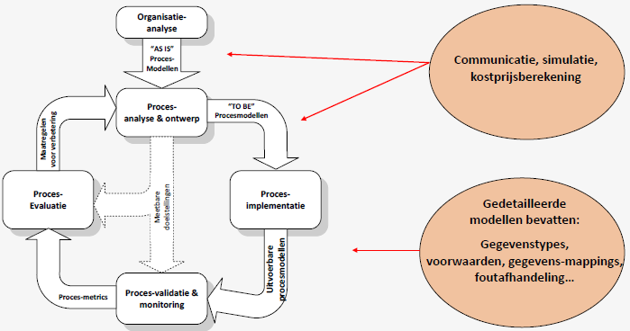
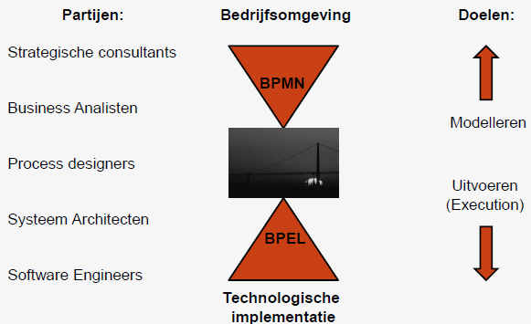
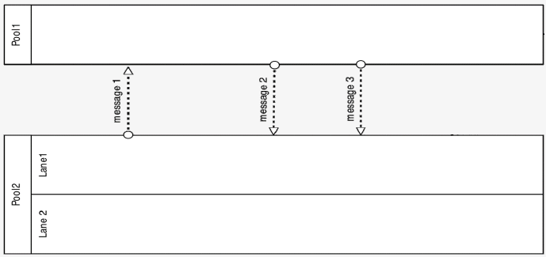
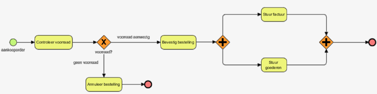
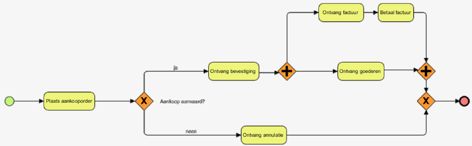
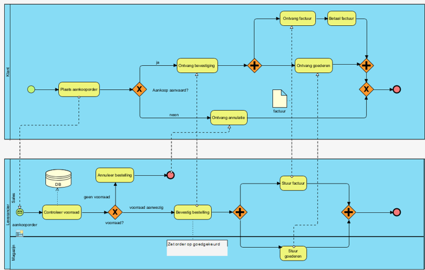
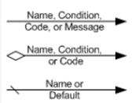
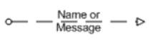
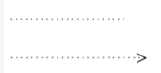

# H07: Business process modeling - deel 1

## Doel van modelleren

Doel: reduceren van complexiteit, vereenvoudigen vd werkelijkheid

Voorwaarden

- Goed model bevat alleen die aspecten waar je grip op probeert te krijgen
- Modelleren is kiezen tussen 2 uitersten
  - Te weinig aspecten: model is te simpel, weinig zinnige conclusies
  - Te veel aspecten: model is te complex, even ingewikkeld als werkelijkheid
- Goed model bevat een boodschap → communicatiemiddel

Wat

- Moeten 1 boodschap bevatten
- Zijn een communicatiemiddel
- Geven antwoord op concrete vragen
- Boodschap moet duidelijk zijn in < 10 minuten
- Modelleren is meer dan tekenen van diagram
- Alle modellen zijn onvolledig, sommige nuttig
- Er bestaan meerdere modellen van 1 proces

Doel  

 
<!--\pagebreak--> 

## Notatietechnieken voor BPM

## Oorsprong

### <u>BPEL</u>

- Business Process Management Institute (BPMI)
  - Onderdeel van Object Management Group (OMG)
  - Ontwikkelt BPML (XML Process execution taal)
  - Realiseert behoefte voor een grafische weergave
- BPML later vervangen door BPEL
  - Business Process Execution Language
  - BPEL als doel uitvoeringstaal
- 2001: Notation Working Group opgericht

### <u>BPMN</u>

- BPMN 1.0 (23 events): 2004, 1.1 (26 events) in 2008, 1.2 in 2009
- BPMN 2.0 (63 events): 2011

## Business Process modeling Notation (BPMN) - tools

- Bizagi Process Modeller
- Aris express
- Visual paradigm
- Microsoft visio
- Draw.io

## BPMN in vogelperspectief

4 types elementen

- Event
- Task
- Flow
- Gateway

### <u>Gateways</u>

Exclusive decision/merge

- Delen ve proces kunnen 2 of meer alternatieve paden volgen
- 1 vd paden wordt effectief genomen
- Ruit met optioneel 'X'

Parallel fork/join

- Parallelle flows creëren (fork) en synchroniseren (join)
- Ruit met '+'

## Organisatie-elementen in procesmodellen

2 basis-abstracties

- Resource
  - Menselijke actor/toestel nodig om een activiteit uit te voeren
- Resource-klasse
  - Verzameling van resources met dezelfde eigenschappen
    - Een rol (competentie, kwalificatie)  
      = classificatie op basis van wat een resource kan/moet doen
    - Een groep (afdeling, team, kantoor, organisatie-eenheid)  
      = classificatie op basis van organisatie-structuur
  - Bv. administratief bediende, manager, ...

### <u>Resource modelling in BPMN</u>

- Zwembaden
  - Onafhankelijke organisatie-eenheden
  - Bv. klant, leverancier, overheid, ...
- Zwembanen
  - Resource-klassen in zelfde organisatie
  - Bv. Verkoop, marketing, productie, HR, ... / Boekhouder, manager, ingenieur, ...

### <u>Zwembaden en -banen - notatie</u>

 
<!--\pagebreak--> 

### <u>Voorstellen v/e proces via BPMN-zwembanendiagram</u>

| Beperkingen                                            | Voordelen                                      |
| :----------------------------------------------------- | :--------------------------------------------- |
| Vele poorten verminderen leesbaarheid                  | Rollen duidelijk weergegeven                   |
| Geen andere objecten dan rollen, activiteiten, outputs | Activiteiten en volgorde duidelijk weergegeven |
|                                                        | Inputs & outputs tussen rollen zijn zichtbaar  |

### <u>BPMN informatie-artefacten</u>

- Data-objecten
  - Mechansimen om aan te geven hoe activiteiten data gebruiken/produceren
  - Stellen input/output ve activiteit voor
- Data-stores
  - Containers van data-objecten die moeten gepersisteerd worden na levensduur vh proces
- Associaties
  - Link leggen tussen artifacten zoals data-objecten en data-stores met flow-objecten
- Text annotations (=commentaren)
  - Extra info voorzien voor de lezer

### <u>Praktisch voorbeeld</u>

Komende van:  
  

Naar (met zwembaden en informatie-artefacten):  

## BPMN poorten

Exclusief (XOR) → 'X' in ruit

- Exclusieve beslissing: 1 van de paden wordt genomen
- Exclusieve merge: ga veder als 1 tak beëindigd is

Parallel (AND) → '+' in ruit

- Parallelle splitsing: alle paden worden genomen
- Parallelle join: ga veder als alle takken beëindigd zijn

Inclusief (OR) → 'O' in ruit

- Inclusieve beslissing: kies 1 of meer takken
- Inclusieve merge: ga verder als alle actieve inkomende takken beëindigd zijn

## Activiteiten

Kenmerken

- Zekere duurtijd
- Verbruikt middelen
- Uitgevoerd door een rol
- Altijd getriggerd door
  - Vorigr activiteitenblok
  - Evenement of gebeurtenis: boodschap, tijd, regel
- Genereert altijd minstens 1 (intermediaire) output
- Uitgevoerd op 1 of meer fysieke plaatsen

Formulering

- Goed: 'verzenden vergunning'
- Fout: 'beheren vergunning', 'verbeteren vergunning', 'verzenden formulier F45', 'verzenden'

 
<!--\pagebreak--> 

Veel gebruikte werkwoorden
|Afwerken|Archiveren|Beoordelen|Bepalen|Berekenen|
|:--|:--|:--|:--|:--|
|Beslissen|Bijwerken|Controleren|Creëren|Evalueren|
|Goedkeuren|Informeren|Invullen|Lanceren|Plannen|
|Produceren|Registreren|Toetsen|Uitvoeren|Valideren|
|Veranderen|Vergelijken|Vergelijken|Voorbereiden|Wijzigen|

## Verbindingselementen
Sequentiële stroom
- Enkel binnen 1 zwembad
- Niet tussen zwembaden

Boodschappenstroom
- Enkel tussen verschillende zwembaden

Associatie
- Verbindt informatie en artefacten met stroomelementen

|Sequentiëel||
|:--|:--|
|Boodschappen||
|Associatie||