# H07: Business process modeling - deel 2

## Expliciete vs impliciete controle-flow (semantiek)
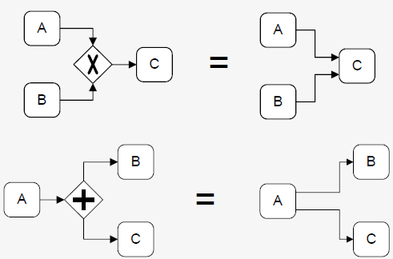

Expliciet (linkse manier van werken): open-/sluit-poorten neerschrijven  
Impliciet (rechtse manier van werken): open-/sluit-poorten niet neerschrijven, duidelijk uit context wat het is  

## Default flows
- Tak die gekozen wordt bij een (X)OR-splitsing als alle andere condities niet waar zijn
- Vermijden deadlocks
- Niet noodzakelijk de meest gebruikte keuze
- Niet verplicht te gebruiken

## Start/end events

### <u>Start events</u>
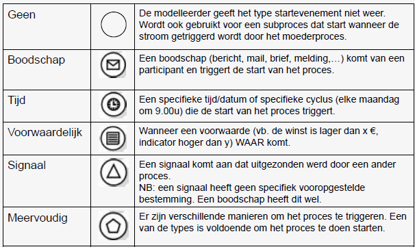

 
<!--\pagebreak--> 

### <u>End events</u>
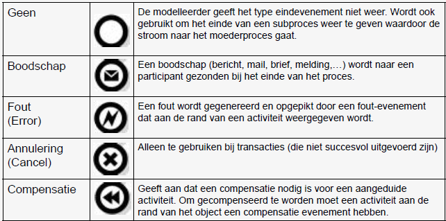
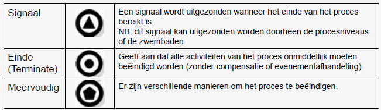

## Intermediate events
Event dat plaatsvindt ergens tussen begin en einde vh proces
- Sturen/ontvangen berichten
- Toont vertraging aan
- Onderbreekt normale flow voor een uitzondering
- Toont extra werk voor een compensatie

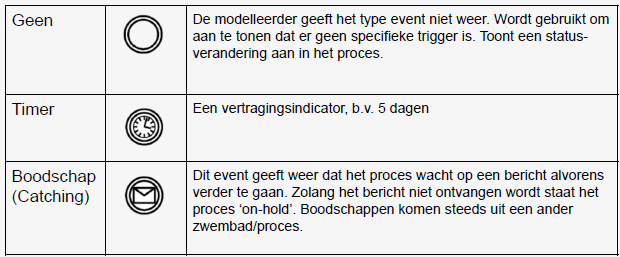
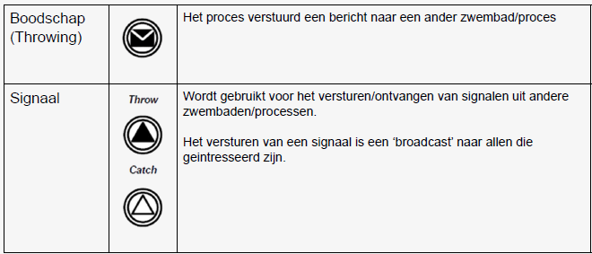

### <u>'Catching' vs 'Throwing'</u>
Catching: boodschappenpijlen komen toe naar het evenement  
Throwing: boodschappenpijlen vertrekken van het evenement

### <u>Uitzonderingsstromen</u>
Uitzonderingsevenement
- Gebeurtenis tijdens de uitvoering van het proces
- De normale stroom van het proces wordt afgeleid buiten de normale stroom
- Kunnen gegenereerd worden door een time-out, fout, boodschap, ...

Uitzonderingsstroom
- Sequentiële stroom die start met uitzonderingsevenement aan de grens van een
activiteit
- Enkel doorlopen wanneer uitzondering zich voordoet
- Normale stroom kan onderbroken worden
  - Interrupting vs non-interrupting

## Soorten activiteiten
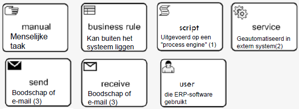

Nummers uit afbeelding
1. BPEL-gestuurd systeem
2. ERP-systeem
3. Indien de taak meer bevat dan versturen/ontvangen, catch/throw-event gebruiken

## Proces-decompositie
- Activiteit ontleden in subproces
- Gebruik dit om
  - Grote modellen op te delen in kleine, duidelijke onderdelen
  - Onderdelen vh procesmodel te identificeren die moeten worden
    - Herhaald
    - Meermaals in parallel
    - Afgebroken
    - Gecompenseerd

Types samengevouwen subprocessen  
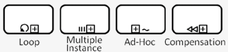

- Lus (loop)-subproces
- Meerdere verzoeken (multi-instance)-subproces
- Ad-hoc proces  
  = groep van activiteiten die geen voorgedefinieerde sequentiële relaties hebben
- Compensatie-subproces  
  = groep van activiteiten die uitgevoerd worden bij het ‘terugdraaien’ van een transactie
om activiteiten te compenseren die uitgevoerd werden tijdens de normale stroom van
een proces

Wanneer
- Als model te groot wordt: moeilijk te begrijpen, verhoogde kans op fouten
- Vuistregel: max 30 flow-objecten per model

### <u>Proces hergebruiken</u>
Subproces ingebed in ouder-proces
- Opgeslagen in zelfde bestand

Hergebruik maximaliseren
- Subproces 'uit bestand te trekken'
- Subproces is dan globaal en kan aangeroepen worden via een call-activiteit (dikkere rand)

### <u>Praktisch voorbeeld</u>
Van:  
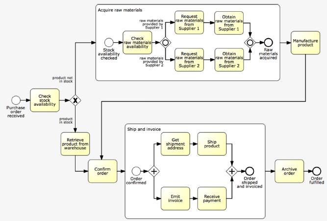

Naar:  
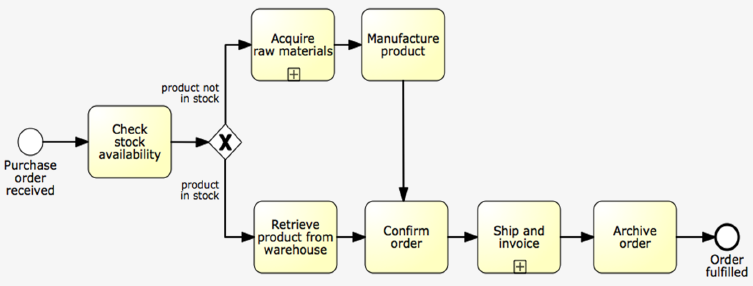

 
<!--\pagebreak--> 

### <u>Syntax-regels voor subprocessen</u>
- Start met minstens één start-event
  - Indien meerdere, dan zal de eerste die voorkomt, het subproces triggeren
- Eindig met minstens één eind-event
  - Het subproces zal beëindigd zijn als alle eind events bereikt zijn. Hierdoor kan een (X)OR-splitsing na het subproces nodig zijn om aan te geven welk(e) event(s) opgetreden is(zijn)
- Sequence flows (pijlen) kunnen de grenzen van een subproces niet overschrijden
  - Gebruik start/end events
- Message flows kunnen wel de grenzen van een subproces overschrijden
  - Om aan te geven dat messages in of uit een subproces kunnen gaan.
  - Signalen/escalaties/errors kunnen verstuurd worden

## Hoofdproces met uitzonderingsstroom
- Proces wordt onderbroken door een escalatie en triggert Problem Management
- Normale flow wordt nooit afgewerkt

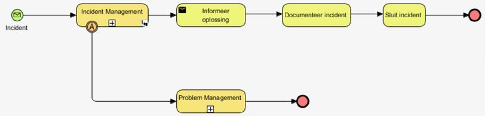

Subproces met interrupting escalatie:  
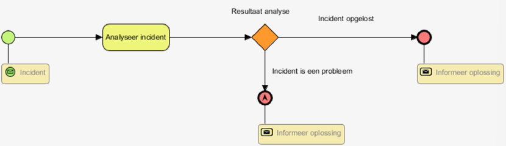

## Standaard lussen (loops)
Repeat loops (repeat until, post-test loop)  
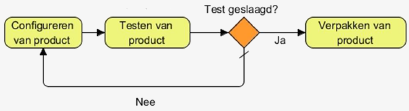  

While loop (while do, pre-test loop)  
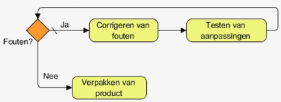  

## Event-driven

### <u>Ports</u>
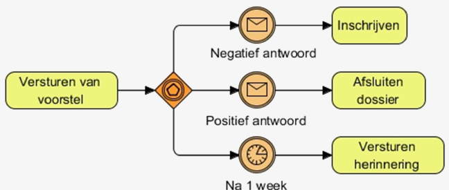

### <u>Gateways</u>
- Bij een data-driven XOR-splitsing, wordt één tak gekozen, op basis van beschikbare gegevens
  - De keuze kan onmiddellijk gemaakt worden als de "estafettestok" aankomt bij de poort
- Soms echter moet de keuze uitgesteld worden tot er zich een gebeurtenis voordoet
  - De keuze is gebaseerd op een race tussen events
- Daarom maakt BPMN een onderscheid tussen data-gedreven en event-gedreven XOR-poorten

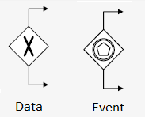

## Hoofdproces met niet-onderbrekende uitzonderingsstroom
- 2e uitzondering kan geactiveerd worden maar onderbreekt de normale flow niet
- Subproces blijft actief

Subproces met 2e escalatie
- Eerstkomend event maakt ander pad onmogelijk

## Artefacten
Data-objecten
- Geen stroomobjecten (niet verbonden doorheen de sequentiële stroom)
- Voorzien in informatie over de manier waarop documenten, data en andere objecten gebruikt en aangepast worden binnen een proces

Groepen
- Organiseren op een visuele wijze activiteiten in een cluster die niet anders kan voorgesteld worden in het diagram
- Niet gebonden aan beperkingen van zwembaden of zwembanen

|Data-objecten||
|:--|:--|
|Groepen||

## Off-page connectoren
- 'bol' met pijltje
- Stop op ene pagina en gaat verder op de volgende

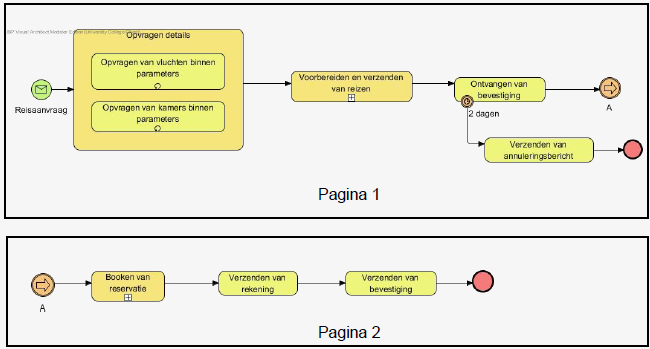

## Vaak voorkomende fouten
- Ontbrekende labels bij (X)OR-splitsingen, message flows, start/end events
- 2 acties in 1 taak → 2 taken
- Taken van een te laag niveau → samenvoegen indien zelfde resource
- Normale sequence flow over zwembad-grenzen → gebruik messages

## Stappenplan BPMN-diagram
- Bepalen van het doel of de finaliteit van het BPMN-diagram
- Bepalen van de context van het proces
- Bepalen van het aantal zwembaden en zwembanen
- Bepalen van het begin- en eindevenement van elk zwembad
- Bepalen van de verschillende activiteiten, poorten, tussentijdse evenementen en sequentiële stromen binnen elk zwembad
- Bepalen van de verschillende boodschappenstromen tussen de zwembaden
- Vervolledigen van het diagram met artefacten waar nodig

 
<!--\pagebreak--> 

## Tips modelleren in BPMN
- Benoem alle objecten in het diagram (behalve de sequentiële stromen)
- Valideer het diagram ten opzichte van de BPMN-regels
- Maak de modellen hiërarchisch
- Start de benoeming van elke activiteit met een actief werkwoord (infinitief)
- Vermijd activiteiten als ‘Versturen naar…’ of ‘Ontvangen van…’ wanneer het een informatieoverdracht betreft binnen 1 zwembad. Deze activiteiten worden vervangen door een sequentiële stroom
- Communicatie aan een manager zonder dat het bijbehorende werk (Bv. dossier) = de activiteit “Informeren van…” in de zwembaan van de zender zonder sequentiële stroom naar de manager
- Indien meerdere eindevenementen zijn dan is het niet nodig om deze te laten samenkomen naar 1 eindevenement

## Voordelen & beperkingen BPMN
|Voordelen|Beperkingen|
|:--|:--|
|Internationaal aanvaarde standaard|Beperkt aantal objecten (geen objecten verbonden met strategie, HR, middelen, wet- en regelgeving)|
|Link met BPEL|Slechts 1 voorstellingswijze (zwembanen)|
|Toegankelijk voor de “business”|Geen datamodellen mogelijk|
||Geen materiaalstromen (alleen informatie- en sequentiële stromen)|